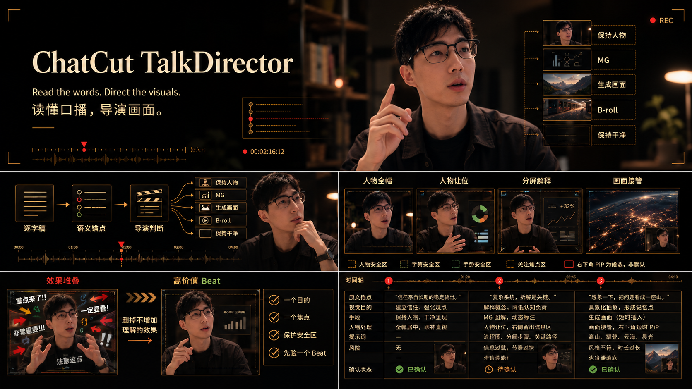
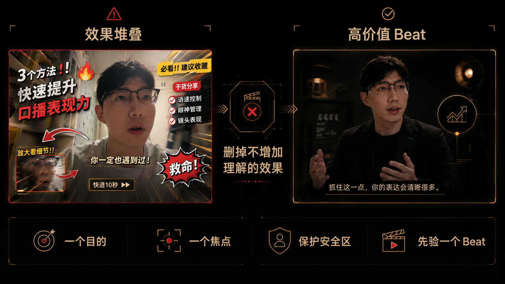
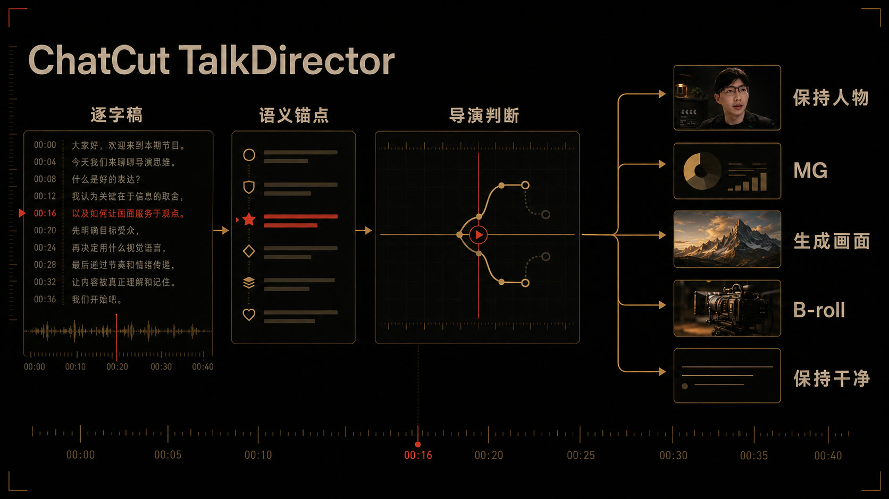
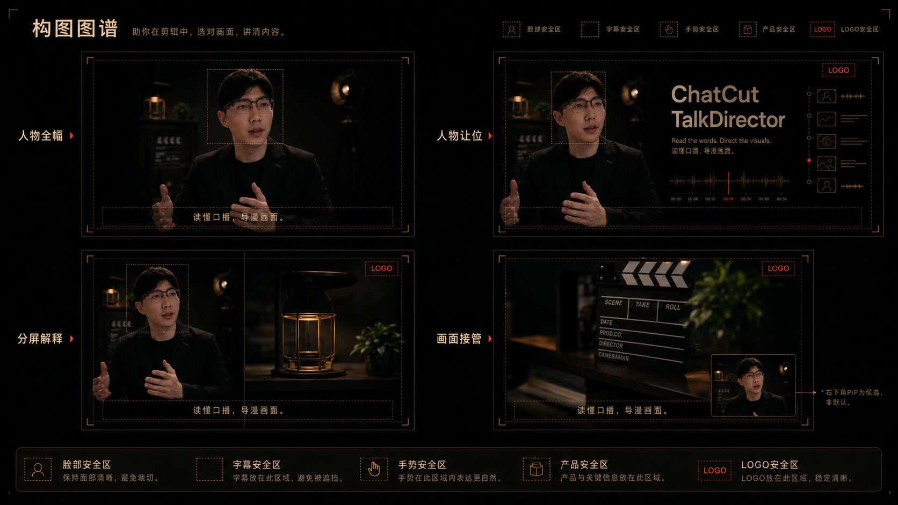
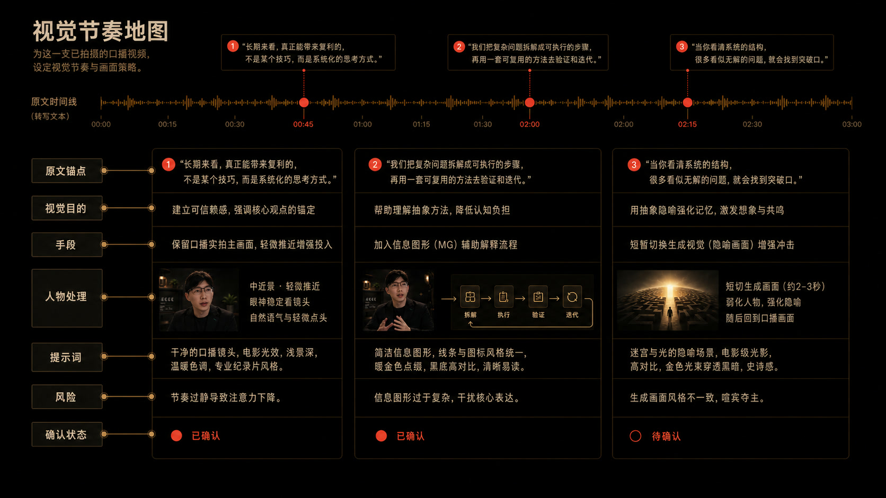
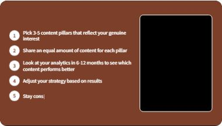
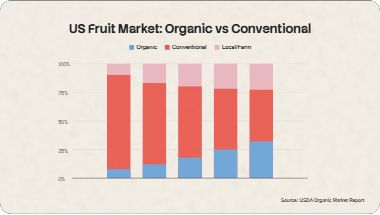
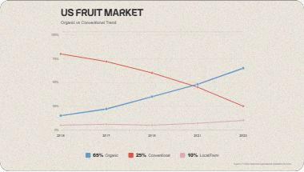
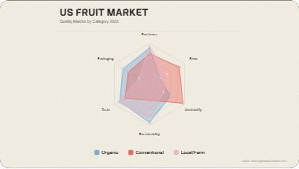
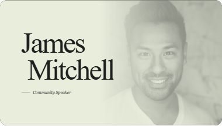

<div align="center">



# ChatCut TalkDirector

**专为口播视频打造的 ChatCut 视觉导演 Skill**

读懂文案与人物动作，在真正值得强化的时刻加入动态图标、关键词、数据图表、补充画面与高级转场。

[](#verified-prompt-series)
[](VISUAL-GALLERY.md)
[](https://chatcut.io/)

[看真实效果](#先看效果) · [复制 Prompt](#直接使用) · [工作方式](#工作方式) · [浏览 123 个官方效果](VISUAL-GALLERY.md) · [安装](#安装)

</div>

## 先看效果

<div align="center">

[](assets/verified-prompts/prompt-001-gesture-logo-pop.mp4)

**Prompt 001 · 手势锚定通用 Logo 弹出**<br>
人物保持全屏，两个官方 Logo 跟随真实手势依次弹出，并在手势结束时退场。

</div>

## 不堆效果，只强化理解



TalkDirector 不追求“特效更多”，只保留能够增加理解、强化焦点并保护人物表达的高价值 Beat。

## 直接使用

```text
在 [时间段]，给人物两侧的指向手势添加 [品牌 A] 和 [品牌 B] 的官方 Logo 弹出特效：[品牌 A] 在画面左侧，[品牌 B] 在画面右侧，分别跟随对应手指抬起时弹出，手势结束时退场。请自动获取可验证的官方 Logo，保持人物全屏，不遮挡脸、字幕、手和产品，并先展示关键帧让我确认。
```

只需替换时间段和品牌名。ChatCut、Claude Code、Cursor、Hyperframes 或其他产品都可以动态识别；TalkDirector 会查找可验证的官方 Logo，并根据每个素材单独处理比例、留白与触发时刻。

[查看 Prompt 001 的完整说明](references/prompt-001-gesture-logo-pop.md)

### Prompt 002 · 双栏讲解

```text
在 [时间段] 制作一段横屏双栏信息动效。左侧作为主视觉，显示标题「[标题]」，并让 [3-5 个要点] 按照叙述顺序逐条浮现：当前项高亮，历史项降低亮度保留，最后进入全部完成状态。右侧作为辅助信息区，放入 [完整长文本] 并让文字持续、匀速、缓慢地由下向上滚动。长文本不要求在视频结束前展示完，不要为了滚完全文而加快速度。右侧宽度不得超过画面的 45%，保持原视频时长和画幅，并先展示开始、中段和结束关键帧让我确认。
```

适用于 Prompt、代码、报告、合同和论文讲解。左侧负责结论，右侧只承担“完整材料正在流动”的证据作用。

[查看 Prompt 002 的完整说明](references/prompt-002-split-screen-explainer.md)

## Verified Prompt Series

每个 Prompt 都从一个具体的口播剪辑需求出发，先在真实时间线上完成，再公开可直接使用的用户 Prompt。

| Prompt | 效果 | 状态 |
| --- | --- | --- |
| **001** | 手势触发一个或多个官方品牌 Logo 弹出 | **已验证上线** |
| **002** | 左侧要点逐条浮现，右侧长文本缓慢滚动 | **已验证上线** |

后续案例会继续加入这个系列，形成专门面向口播视频的可复用特效库。

## 工作方式



先读逐字稿和语义锚点，再决定保持人物、加入 MG、生成画面、使用 B-roll，或者让画面保持干净。

## 构图图谱



人物全幅、人物让位、分屏解释和画面接管不是固定模板，而是根据内容、手势、字幕与安全区做出的导演选择。

## 视觉节奏地图



每个视觉 Beat 都绑定原文锚点、视觉目的、画面手段、人物处理、风险与确认状态，让整条视频有节奏而不是随机加效果。

## 它能为口播加什么

| 观看任务 | TalkDirector 的处理 |
| --- | --- |
| 强调产品或品牌 | 图标、Logo、产品卡跟随手势或语义出现 |
| 解释关键词和步骤 | 关键词卡、编号列表、流程与对比动画 |
| 呈现数据和证据 | 柱状图、折线图、雷达图、数字计数器 |
| 切换章节和身份 | 章节标题、人物介绍、字幕条、引用卡 |
| 原画面不够 | 生成补充画面、B-roll、分屏或全屏视觉 |
| 画面已经足够强 | 保持人物与原画面干净，不为特效而特效 |

## 官方 Prompt 精选

TalkDirector 已接入 ChatCut 官方 Prompt Library。需求吻合时直接复用经过验证的官方结构，再根据人物、字幕和真实安全区调整。

<table>
<tr>
<td width="50%" valign="top">
<a href="https://app.chatcut.io/?source=prompt-library&target=motion-graphics&template=8303fddb-dba0-474b-a1cc-58f40728482b"></a><br>
<strong>编号要点 + 口播人物</strong><br>
人物保留在右侧，左侧依次弹出重点列表。
</td>
<td width="50%" valign="top">
<a href="https://app.chatcut.io/?source=prompt-library&target=motion-graphics&template=e816057d-bd49-4a82-880c-d4555a9c1dce"></a><br>
<strong>关键词卡 + 口播人物</strong><br>
用大字强化核心观点，同时保留人物表达。
</td>
</tr>
<tr>
<td width="50%" valign="top">
<a href="https://app.chatcut.io/?source=prompt-library&target=motion-graphics&template=1a4cd0c3-ba36-4457-8428-49e57c61292f"></a><br>
<strong>堆叠柱状图动画</strong><br>
把比例变化和构成关系变成可读的动态证据。
</td>
<td width="50%" valign="top">
<a href="https://app.chatcut.io/?source=prompt-library&target=motion-graphics&template=38bd86e5-2f30-46f7-ade8-1a9711220f0d"></a><br>
<strong>折线图动画</strong><br>
用趋势交叉和增长变化解释口播中的数据。
</td>
</tr>
<tr>
<td width="50%" valign="top">
<a href="https://app.chatcut.io/?source=prompt-library&target=motion-graphics&template=6cdf1268-c279-4c5d-a540-3f59501fbe0d"></a><br>
<strong>雷达图动画</strong><br>
直观比较多个维度的优势、短板与差异。
</td>
<td width="50%" valign="top">
<a href="https://app.chatcut.io/?source=prompt-library&target=motion-graphics&template=a2abdfc4-c794-4224-b89a-07c0f4009129"></a><br>
<strong>人物介绍卡</strong><br>
用杂志感排版快速建立讲述者身份与专业感。
</td>
</tr>
</table>

<div align="center">

### [浏览全部 123 个官方效果 →](VISUAL-GALLERY.md)

</div>

## 3 步完成一条口播

1. **给出口播视频和目标**：例如“让这段产品讲解更有节奏”，或直接粘贴一个具体 Prompt。
2. **确认视觉方案**：TalkDirector 识别文案、时间点、人物动作和安全区，匹配官方效果或设计定制画面。
3. **先验证一个效果再扩展**：展示真实开始、中段与结束画面，确认满意后再应用到其他高价值时刻。

## 安装

```powershell
git clone https://github.com/Fangx-AI/chatcut-talkdirector.git
New-Item -ItemType Junction `
  -Path "$HOME\.codex\skills\chatcut-talking-head-visual-director" `
  -Target "$(Resolve-Path .\chatcut-talkdirector)"
```

在 Codex 中这样调用：

```text
使用 $chatcut-talking-head-visual-director 分析这条口播，先给我一个最值得做的视觉效果。
```

## 技术细节

[Skill 定义](SKILL.md) · [完整视觉画廊](VISUAL-GALLERY.md) · [官方 Prompt 目录](references/chatcut-official-catalog.md) · [导演框架](references/visual-director-framework.md) · [质量门禁](references/quality-gate.md) · [测试证据](tests/forward-results.md)
