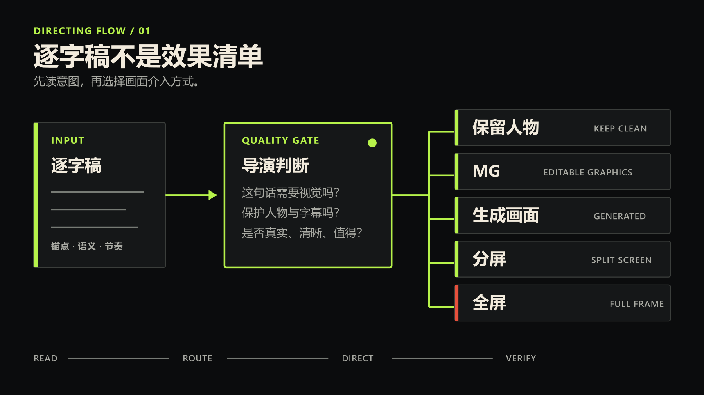
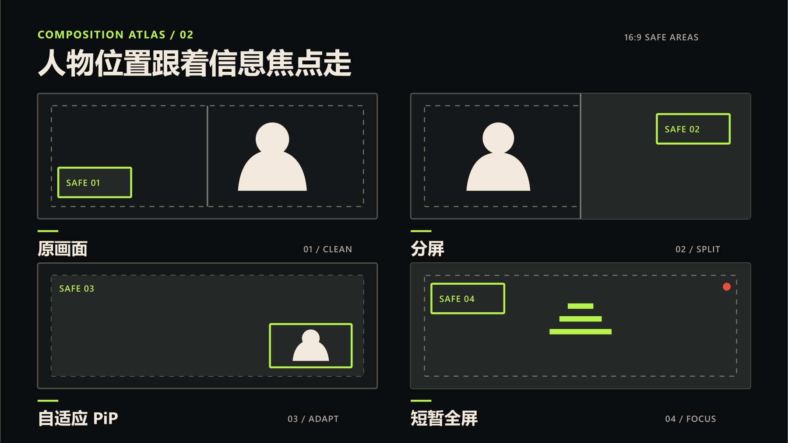
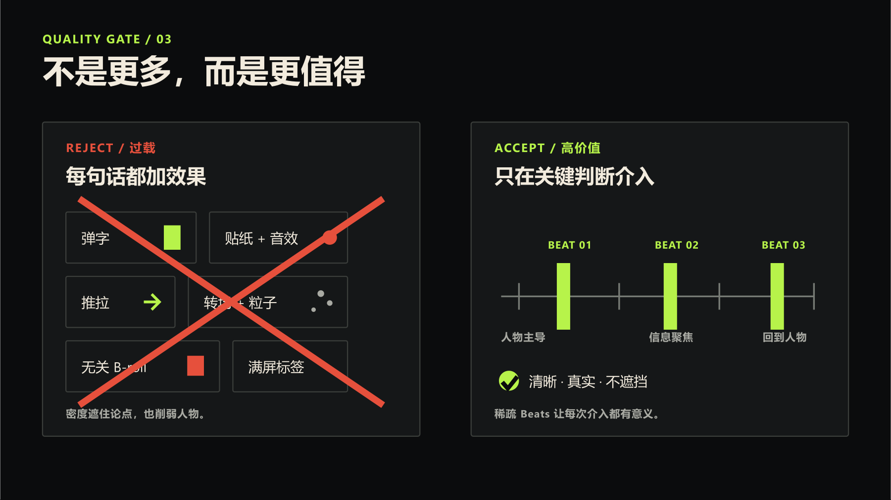
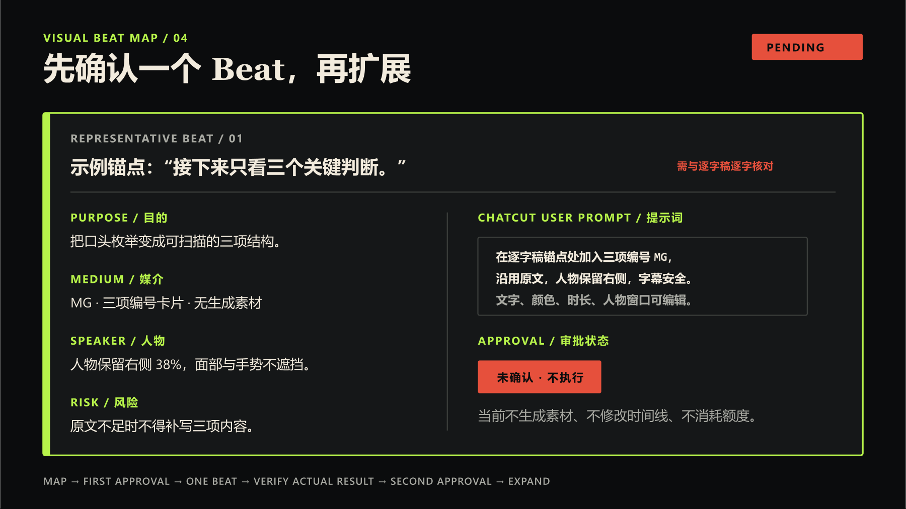

<div align="center">


# ChatCut TalkDirector

**Read the words. Direct the visuals.**<br>
**读懂口播，导演画面。**

专门为已经拍好的口播视频做视觉导演：读懂文案，再判断何时保留人物、加入 MG、补充生成画面、改变构图，或让画面保持干净。

[](#验证)
[](references)
[](SKILL.md)

[为什么](#为什么需要它) · [怎么工作](#怎么工作) · [视觉判断](#视觉判断) · [示例](#visual-beat-map-示例) · [安装](#安装)

</div>

## 为什么需要它

已经拍好的口播，往往内容足够强，画面却长时间停留在同一种人物构图里。

给每句话都加特效并不会解决问题。过高的视觉密度会让成片更廉价，也让观众更难抓住真正重要的信息。

## 怎么工作

TalkDirector 读取逐字稿中的原文锚点，找到高价值时刻，再把它们分流到保留人物、MG、生成画面、B-roll 或保持干净。



视觉跟随语义：需要信任时保留人物，需要解释时建立关系，需要证据时使用真实素材，不增加理解时就不加效果。

扩展整条视频之前，只执行一个有代表性的 Beat，核验实际开始、中段和结束画面，再等待第二次确认。

规划本身从不授权生成素材、修改时间线或消耗额度。任何执行都必须经过明确确认。

## 视觉判断

| Route | Use when | Speaker |
| --- | --- | --- |
| 保持人物 | 表情、信任和语气更重要 | 全幅保留 |
| MG | 关键词、步骤、关系或数字需要解释 | 原画面、分屏或透明叠加 |
| 生成画面 | 抽象隐喻或缺少可用画面 | 短暂全屏或分屏 |
| B-roll | 有真实素材可以补充事实 | 人物让位 |
| 保持干净 | 视觉不会增加理解 | 不加效果 |



人物位置由真实安全区决定。右下角 PiP 只是候选构图，永远不是默认值。

## Quality Gate



- 每个 Beat 只有一个目的和一个视觉焦点。
- 单个 Beat 最多保留两种廉价效果家族。
- 保护脸、字幕、手势、产品、Logo 和运动路径。
- 生成 Beat 默认使用一个连续镜头和一个主运镜。

完整规则见 [视觉质量门禁](references/quality-gate.md)。

## Visual Beat Map 示例



Visual Beat Map 先把原文锚点、视觉目的、手段、人物处理、提示词、风险和确认状态写清楚，再进入执行。查看[中文完整示例](references/examples-zh.md)或[英文完整示例](references/examples-en.md)。

## 安装

```powershell
git clone https://github.com/Fangx-AI/chatcut-talkdirector.git
New-Item -ItemType Junction `
  -Path "$HOME\.codex\skills\chatcut-talking-head-visual-director" `
  -Target "$(Resolve-Path .\chatcut-talkdirector)"
```

## 调用

```text
使用 $chatcut-talking-head-visual-director 分析这条口播，
先输出可确认的 Visual Beat Map，不要直接生成或修改时间线。
```

默认交付物和完整确认边界定义在根目录 [SKILL.md](SKILL.md) 中。

## 仓库结构

```text
SKILL.md                 根 Skill 与确认边界
references/              12 份聚焦参考文档
references/examples-zh.md  中文完整示例
references/examples-en.md  英文完整示例
tests/                   9 个行为场景及评分证据
assets/                  README 视觉资产
```

仓库包含 1 个根 Skill、12 份聚焦参考文档、中英文完整示例，以及 9 个行为场景。

## 验证

[前向测试结果](tests/forward-results.md)记录了 9/9 个行为场景的可见响应、评分与门禁证据。它验证的是离线规划行为，不是成片展示。

## 当前边界

仓库的离线行为证据不覆盖 ChatCut 实时时间线执行，也不覆盖实际的额度门禁流程。README 不展示或暗示虚构的生成结果、时间线修改或额度消耗。
