# ChatCut 官方 Prompt 视觉画廊

先看效果，再决定怎么剪。这里收录 **123 个官方效果**：104 个 Motion Graphics、14 个 Seedance 2 视频生成方案和 5 个 App Promo。

- 动效：点击预览图，直接在 ChatCut 中使用。
- 视频：点击封面观看官方预览，再进入 ChatCut 使用。

> 官方目录同步于 2026-07-16，来源：[ChatCut Prompt Library](https://chatcut.io/prompt-library)。

## 口播增强

<table>
<tr>
<td width="50%" valign="top">
 
<strong>AI Speaker Intro Card</strong> 
Create a premium, magazine-style full screen introduction with large serif typography and a blended ghost portrait. 
点击预览图，在 ChatCut 中使用
</td>
<td width="50%" valign="top">
 
<strong>AI Editorial Lower Third</strong> 
Create elegant magazine-style lower third with staggered text reveal, animated line separator, and subtle ghost portrait background. 
点击预览图，在 ChatCut 中使用
</td>
</tr>
<tr>
<td width="50%" valign="top">
 
<strong>AI Numbered Talking-Head Overlay</strong> 
Create full-screen overlay that frames a talking head video on the right with a transparent cutout, while numbered bullet points snap into place on the left. 
点击预览图，在 ChatCut 中使用
</td>
<td width="50%" valign="top">
<a href="https://app.chatcut.io/?source=prompt-library&target=motion-graphics&template=83a77388-8670-4df0-bd5e-b4e3b59c92ce">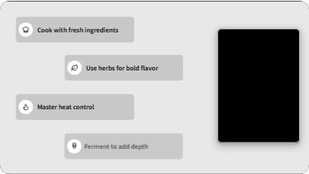</a> 
<strong>AI Bullet Points Overlay</strong> 
Create a split-screen layout overlay featuring a talking-head video placeholder and four staggered bullet points that instantly pop onto the screen in sequence. 
点击预览图，在 ChatCut 中使用
</td>
</tr>
<tr>
<td width="50%" valign="top">
 
<strong>AI Talking-Head Keyword Card</strong> 
Create a full-screen layout featuring sequential bold typography on the left and a rounded transparent cutout window for video on the right. 
点击预览图，在 ChatCut 中使用
</td>
<td width="50%" valign="top">
<a href="https://app.chatcut.io/?source=prompt-library&target=motion-graphics&template=4a1c2bc0-9798-4ef4-bbf9-0517cc5ca787">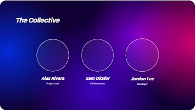</a> 
<strong>Group Project — Team Members</strong> 
Create a full-screen presentation slide featuring a dynamic liquid metal background and three team member portrait areas that sequentially animate into view. 
点击预览图，在 ChatCut 中使用
</td>
</tr>
<tr>
<td width="50%" valign="top">
<a href="https://app.chatcut.io/?source=prompt-library&target=motion-graphics&template=5957f338-1913-4571-8f5d-07304f691bec">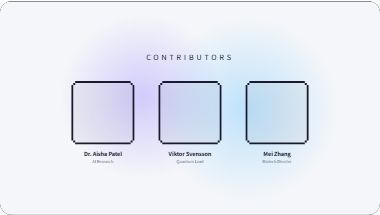</a> 
<strong>Tech Trends 2026 — Team Members</strong> 
Create a retro-modern grid layout introducing three contributors with pixel-framed portrait placeholders and soft animated gradient blobs in the background. 
点击预览图，在 ChatCut 中使用
</td>
<td width="50%"></td>
</tr>
</table>

## 数据与图表

<table>
<tr>
<td width="50%" valign="top">
 
<strong>AI Stack Chart Animation</strong> 
(()=&gt;{var e=async t=&gt;{await(await t())()};(self.Astro||(self.Astro={})).only=e;window.dispatchEvent(new Event(&quot;astro:only&quot;));})(); 
点击预览图，在 ChatCut 中使用
</td>
<td width="50%" valign="top">
 
<strong>AI Line Chart Animation</strong> 
Create a 5-year trend line chart featuring an organic, hand-drawn aesthetic with paper texture and cleanly animated drawing strokes. 
点击预览图，在 ChatCut 中使用
</td>
</tr>
<tr>
<td width="50%" valign="top">
 
<strong>AI Radar Chart Animation</strong> 
Create a animated spider chart featuring a hand-drawn paper aesthetic, complete with sketchy grid lines, spring-animated semi-transparent polygons, and an editorial layout. 
点击预览图，在 ChatCut 中使用
</td>
<td width="50%" valign="top">
<a href="https://app.chatcut.io/?source=prompt-library&target=motion-graphics&template=0273f371-8c99-4d7f-b51e-096edd9d2188">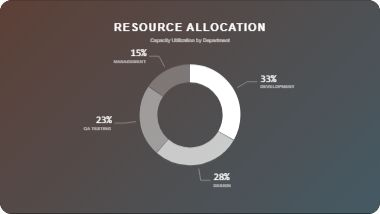</a> 
<strong>AI Pie Chart Animation</strong> 
Create 4-ring concentric chart with sweeping animation and connecting value labels styled like an infographic. 
点击预览图，在 ChatCut 中使用
</td>
</tr>
<tr>
<td width="50%" valign="top">
<a href="https://app.chatcut.io/?source=prompt-library&target=motion-graphics&template=847102e7-ec7f-4c4c-ad8a-f015f5b31fc7">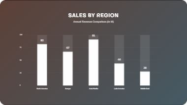</a> 
<strong>AI Vertical Bar Chart</strong> 
Create a clean, minimal vertical bar chart with staggered entrance animations, custom background gradient, and semi-transparent bar tracks. 
点击预览图，在 ChatCut 中使用
</td>
<td width="50%" valign="top">
<a href="https://app.chatcut.io/?source=prompt-library&target=motion-graphics&template=9e4ffbcc-ec05-4a3b-b54f-0ffe7f571efd">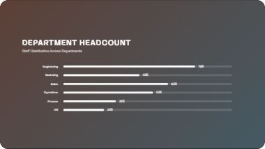</a> 
<strong>AI Horizontal Bar Chart</strong> 
Create a minimal, clean horizontal bar chart with staggered entrance animations, custom gradients, and percentage counters matching an infographic style. 
点击预览图，在 ChatCut 中使用
</td>
</tr>
<tr>
<td width="50%" valign="top">
<a href="https://app.chatcut.io/?source=prompt-library&target=motion-graphics&template=d03ead86-a81b-4638-98d3-2fae21c1715b">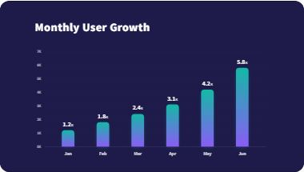</a> 
<strong>AI Monthly Growth Chart</strong> 
Create a sleek, dark-themed infographic bar chart with a staggered upward spring animation for bars, accompanied by fading grid lines and data labels. Perfectly tuned for premium... 
点击预览图，在 ChatCut 中使用
</td>
<td width="50%" valign="top">
<a href="https://app.chatcut.io/?source=prompt-library&target=motion-graphics&template=798fa1a8-771d-4c97-b900-8a9004266304">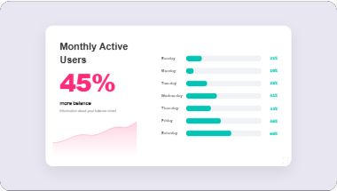</a> 
<strong>AI MAU Dashboard Chart</strong> 
Create pure Color Infographics style dashboard card featuring a large KPI and an animated horizontal bar chart for days of the week, complete with a stylized virus/molecule... 
点击预览图，在 ChatCut 中使用
</td>
</tr>
<tr>
<td width="50%" valign="top">
<a href="https://app.chatcut.io/?source=prompt-library&target=motion-graphics&template=c430c730-8ff2-4a4b-86af-230563431c49">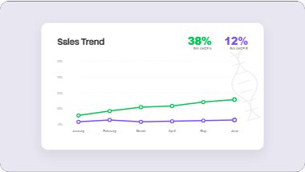</a> 
<strong>AI Sales Trend Chart</strong> 
Create a clean, modern line chart with two data series, animated drawing effects, pop-in data points, and a subtle DNA helix watermark. Ideal for financial or medical data... 
点击预览图，在 ChatCut 中使用
</td>
<td width="50%" valign="top">
<a href="https://app.chatcut.io/?source=prompt-library&target=motion-graphics&template=5e015143-44fa-4cc4-bb04-f692e011a1ee">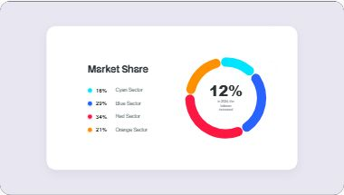</a> 
<strong>AI Donut Chart Animation</strong> 
Create a clean, vibrant donut chart infographic with animated segments, a legend, and a stylized DNA helix watermark. 
点击预览图，在 ChatCut 中使用
</td>
</tr>
<tr>
<td width="50%" valign="top">
<a href="https://app.chatcut.io/?source=prompt-library&target=motion-graphics&template=c63df7ef-fc63-491b-ae4b-30a34d88d8ae">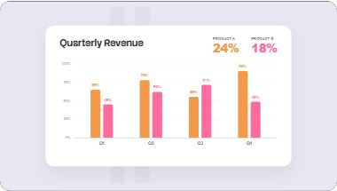</a> 
<strong>AI Revenue Comparison Chart</strong> 
Create a crisp and vibrant grouped bar chart showing quarterly performance of two products with count-up data labels, animated growth bars, and large summary KPIs. 
点击预览图，在 ChatCut 中使用
</td>
<td width="50%" valign="top">
<a href="https://app.chatcut.io/?source=prompt-library&target=motion-graphics&template=d82c1bd4-4654-4f92-809d-32eba00a88f0">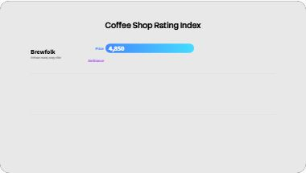</a> 
<strong>AI Benchmark Comparison Chart</strong> 
Create a dynamic benchmark chart recreating a Geekbench CPU score comparison between three devices, featuring smooth bar stretches and slot-machine style number rolls. 
点击预览图，在 ChatCut 中使用
</td>
</tr>
<tr>
<td width="50%" valign="top">
 
<strong>AI Shopping Tips Card</strong> 
Create shopping Tips Animation infographic template with editable text, metrics, and accent colors. 
点击预览图，在 ChatCut 中使用
</td>
<td width="50%" valign="top">
 
<strong>AI Checklist Animation</strong> 
Create checklist Tick Animation infographic template with editable text, metrics, and accent colors. 
点击预览图，在 ChatCut 中使用
</td>
</tr>
<tr>
<td width="50%" valign="top">
<a href="https://app.chatcut.io/?source=prompt-library&target=motion-graphics&template=7d205758-dac2-4df5-9735-7ad781d792af">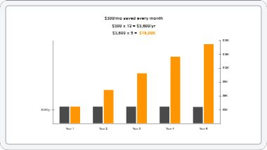</a> 
<strong>Bar chart growth animation</strong> 
Create a full-screen dual-axis grouped bar chart with staggered growth animations, grid background, and a formula header. 
点击预览图，在 ChatCut 中使用
</td>
<td width="50%" valign="top">
<a href="https://app.chatcut.io/?source=prompt-library&target=motion-graphics&template=64a9ecbd-cf02-434f-8a36-f2567d061b18">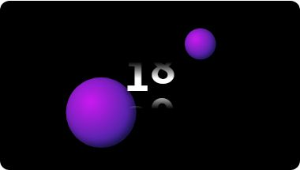</a> 
<strong>MindSpace — Number Counter</strong> 
Create two 3D gradient spheres pop in and float smoothly in the background while a large bold central number increments via a staggered slot-machine roll animation. 
点击预览图，在 ChatCut 中使用
</td>
</tr>
<tr>
<td width="50%" valign="top">
<a href="https://app.chatcut.io/?source=prompt-library&target=motion-graphics&template=2b8c54b0-3429-481b-8dcd-dbbe3acd8f03">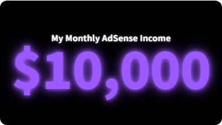</a> 
<strong>Revenue counter stat reveal overlay</strong> 
Create a cinematic overlay featuring a glowing white title and a vibrant, vivid purple rolling number counter that increments with an ease-out deceleration. Both elements enter... 
点击预览图，在 ChatCut 中使用
</td>
<td width="50%" valign="top">
 
<strong>MindSpace — Weekly Progress Bar Chart</strong> 
Create a sleek, deep navy and rich purple animated bar chart featuring perfectly timed solid white bars that spring upward sequentially with counting value labels. 
点击预览图，在 ChatCut 中使用
</td>
</tr>
<tr>
<td width="50%" valign="top">
<a href="https://app.chatcut.io/?source=prompt-library&target=motion-graphics&template=b18138db-db81-4e97-8eec-30e69ca071b3">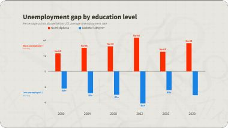</a> 
<strong>Finance Explainer — Bar Chart Diverging Animated</strong> 
Create a editorial grouped bar chart animating Florida vs US popular vote margins from the zero-line with staggered reveals, matching FT visual style. 
点击预览图，在 ChatCut 中使用
</td>
<td width="50%" valign="top">
<a href="https://app.chatcut.io/?source=prompt-library&target=motion-graphics&template=82876903-b57c-44dd-95cf-e5482749b399">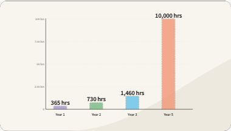</a> 
<strong>Bar chart growth animation</strong> 
Create a stylish, infographic-style animated bar chart with dashed outlines, custom colors, and sequential growth animations. 
点击预览图，在 ChatCut 中使用
</td>
</tr>
<tr>
<td width="50%" valign="top">
<a href="https://app.chatcut.io/?source=prompt-library&target=motion-graphics&template=9f4d7811-0ee5-4b92-b8cb-35e980edf8ac">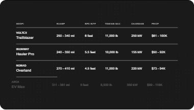</a> 
<strong>Dark Tech — Comparison Table</strong> 
Create a high-end comparison table featuring a diagonal wipe reveal, sequential staggered row entries (slide in left, line grow right), and an animated sine-wave dot grid... 
点击预览图，在 ChatCut 中使用
</td>
<td width="50%" valign="top">
<a href="https://app.chatcut.io/?source=prompt-library&target=motion-graphics&template=d8ed2e4b-8b7e-4b4d-8942-7ac0c4b7800a">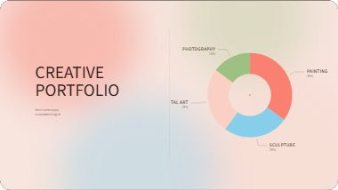</a> 
<strong>Creative Watercolor — Data Chart</strong> 
Create a elegant, warm watercolor-themed pie chart with sequential segment reveals and thin serif typography. 
点击预览图，在 ChatCut 中使用
</td>
</tr>
<tr>
<td width="50%" valign="top">
<a href="https://app.chatcut.io/?source=prompt-library&target=motion-graphics&template=1b401c0b-0bd3-47e0-a64f-93f470e2fb6c">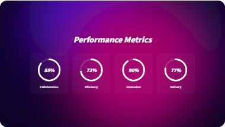</a> 
<strong>Group Project — Data Chart</strong> 
Create four circular progress indicators revealing metrics sequentially over an immersive, animated liquid metal background. 
点击预览图，在 ChatCut 中使用
</td>
<td width="50%" valign="top">
<a href="https://app.chatcut.io/?source=prompt-library&target=motion-graphics&template=f3fb5e13-4727-45d2-8c1d-fb963b354a1e">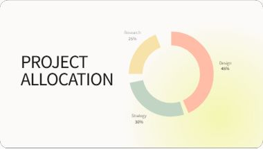</a> 
<strong>Minimal Gradient — Data Chart</strong> 
Create a refined minimal presentation slide featuring a sequential animated donut chart, an organic soft gradient background, and large elegant typography. 
点击预览图，在 ChatCut 中使用
</td>
</tr>
<tr>
<td width="50%" valign="top">
<a href="https://app.chatcut.io/?source=prompt-library&target=motion-graphics&template=c1d4287a-a6b4-4710-a1dd-bc6420554923">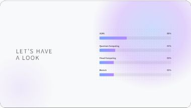</a> 
<strong>Tech Trends 2026 — Data Chart</strong> 
Create a modern, spacious bar chart animation with a soft gradient blob background and subtle pixel grid styling. 
点击预览图，在 ChatCut 中使用
</td>
<td width="50%" valign="top">
<a href="https://app.chatcut.io/?source=prompt-library&target=motion-graphics&template=243aa8dd-9cd9-41ac-8972-05d2e505f036">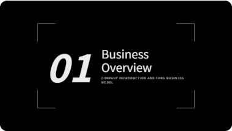</a> 
<strong>Chapter Title Card — Business Overview</strong> 
Create a high-contrast, monochrome editorial-style chapter intro featuring an oversized italic number, white serif title, and minimalist geometric bracket frames. 
点击预览图，在 ChatCut 中使用
</td>
</tr>
<tr>
<td width="50%" valign="top">
<a href="https://app.chatcut.io/?source=prompt-library&target=motion-graphics&template=6d784a29-b0d8-4228-8489-b0f75bf34c0e">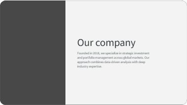</a> 
<strong>Company Introduction — Split Layout</strong> 
Create a sophisticated split-layout animation featuring a dark architectural photo with geometric lines on the left, and elegant typography fading in on the right. 
点击预览图，在 ChatCut 中使用
</td>
<td width="50%" valign="top">
<a href="https://app.chatcut.io/?source=prompt-library&target=motion-graphics&template=dd96bb2f-ec3c-466b-84b6-23c5735339b7">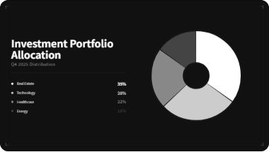</a> 
<strong>Data Chart — Investment Portfolio Allocation</strong> 
Create a sophisticated monochrome data visualization featuring an animated donut chart with elegantly staggered segments and a precise editorial layout. 
点击预览图，在 ChatCut 中使用
</td>
</tr>
<tr>
<td width="50%" valign="top">
<a href="https://app.chatcut.io/?source=prompt-library&target=motion-graphics&template=32da30ba-83e3-43df-94f6-0f62e996a815">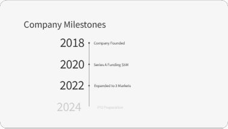</a> 
<strong>Timeline — Company Milestones</strong> 
Create a clean, high-end editorial timeline layout featuring oversized serif typography and a thin geometric spine, perfect for financial documents and corporate milestones. 
点击预览图，在 ChatCut 中使用
</td>
<td width="50%" valign="top">
<a href="https://app.chatcut.io/?source=prompt-library&target=motion-graphics&template=76002b44-e277-4db9-80ca-a5c9e0cb15f3">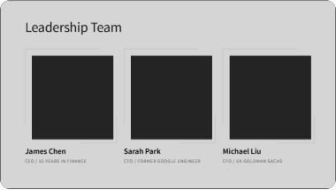</a> 
<strong>Team Members — Leadership Grid</strong> 
Create a sophisticated, monochrome 3-column team introduction grid with staggered staggered animation and geometric line frames. 
点击预览图，在 ChatCut 中使用
</td>
</tr>
<tr>
<td width="50%" valign="top">
<a href="https://app.chatcut.io/?source=prompt-library&target=motion-graphics&template=264faf42-2010-4812-94c6-b3c389204815">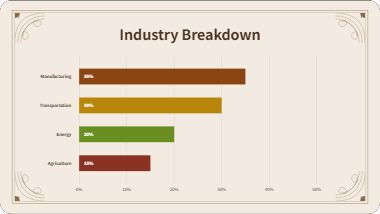</a> 
<strong>Reconstruction Era — Data Chart</strong> 
Create a elegant Victorian-style horizontal bar chart on parchment background with drawing border flourishes. 
点击预览图，在 ChatCut 中使用
</td>
<td width="50%"></td>
</tr>
</table>

## 列表与步骤

<table>
<tr>
<td width="50%" valign="top">
<a href="https://app.chatcut.io/?source=prompt-library&target=motion-graphics&template=3554d937-05c5-4ffb-835d-aa8db1a48ace">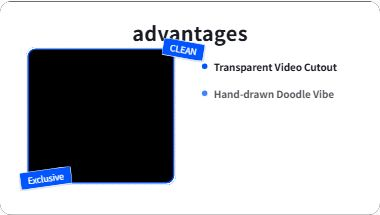</a> 
<strong>Hand-Drawn List Overlay</strong> 
Create a playful overlay frame with a transparent video cutout window, bouncy tag badges, and a staggered list reveal animation — perfect for showcasing product features or... 
点击预览图，在 ChatCut 中使用
</td>
<td width="50%" valign="top">
 
<strong>Chapter page number icon animation</strong> 
Create a clean, modern chapter title sequence featuring an animated numbered badge and two cascading lines of bold text. 
点击预览图，在 ChatCut 中使用
</td>
</tr>
<tr>
<td width="50%" valign="top">
<a href="https://app.chatcut.io/?source=prompt-library&target=motion-graphics&template=58b32a8f-8d9e-4521-85d6-277dfb37fd68">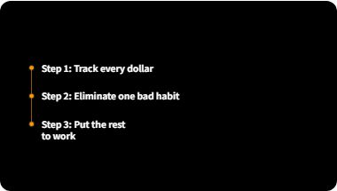</a> 
<strong>Vertical timeline animation</strong> 
Create a vertical timeline featuring three nodes that appear sequentially with a slow, elegant ease-out cubic animation. 
点击预览图，在 ChatCut 中使用
</td>
<td width="50%" valign="top">
 
<strong>MindSpace — Self-Check Questions</strong> 
Create a list of questions revealing one by one via soft springs, ending with a final typewriter-effect question and a blinking cursor, set over a deep purple bokeh background. 
点击预览图，在 ChatCut 中使用
</td>
</tr>
<tr>
<td width="50%" valign="top">
 
<strong>Numbered list card — 4 items with circle stroke animation</strong> 
Create a clean, dark editorial overlay displaying a sequenced numbered list with animated glowing circle badges and cascading text items. 
点击预览图，在 ChatCut 中使用
</td>
<td width="50%" valign="top">
<a href="https://app.chatcut.io/?source=prompt-library&target=motion-graphics&template=847b9656-7989-42c6-ab6a-87a8efe0a20a">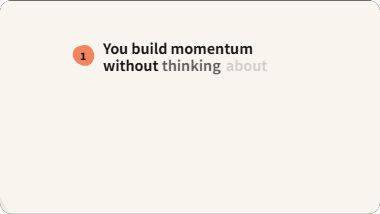</a> 
<strong>Numbered pebble-badge list with word reveal</strong> 
Create a refined list card with organic pebble-shaped numbered badges and staggered, animated serif text, set over a soft sweeping background. 
点击预览图，在 ChatCut 中使用
</td>
</tr>
<tr>
<td width="50%" valign="top">
<a href="https://app.chatcut.io/?source=prompt-library&target=motion-graphics&template=a9f9348f-eb15-4064-b5d8-f164dd82cb9b">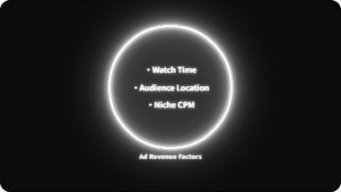</a> 
<strong>Glowing Ring MG — bullet list reveal</strong> 
Create a cinematic overlay featuring a central expanding glowing ring with sequentially fading text elements and a subtle noise grain background. 
点击预览图，在 ChatCut 中使用
</td>
<td width="50%" valign="top">
 
<strong>Dark Tech — Spec Sheet</strong> 
Create a dark tech layout featuring a neon-flickering title and a staggering list of specs with a typewriter fade-in effect over a subtle animated dot-wave background. 
点击预览图，在 ChatCut 中使用
</td>
</tr>
<tr>
<td width="50%" valign="top">
<a href="https://app.chatcut.io/?source=prompt-library&target=motion-graphics&template=3cc81aaa-2429-4be0-acc1-5e39dd946836">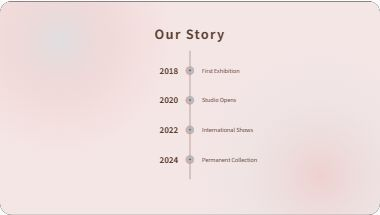</a> 
<strong>Creative Watercolor — Timeline</strong> 
Create a elegant, organic vertical timeline with watercolor accents and painted markers drawing in sequentially. 
点击预览图，在 ChatCut 中使用
</td>
<td width="50%" valign="top">
<a href="https://app.chatcut.io/?source=prompt-library&target=motion-graphics&template=4444d0ce-ac02-4831-ad25-dd90b6aea350">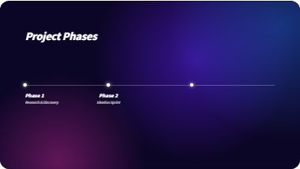</a> 
<strong>Group Project — Timeline</strong> 
Create a immersive 4-phase timeline layered over a rich animated liquid silk background. 
点击预览图，在 ChatCut 中使用
</td>
</tr>
<tr>
<td width="50%" valign="top">
<a href="https://app.chatcut.io/?source=prompt-library&target=motion-graphics&template=75dae426-6c04-4ffd-9de5-9a4c5959d87c">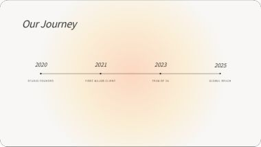</a> 
<strong>Minimal Gradient — Timeline</strong> 
Create a elegant, horizontal timeline that reveals 4 milestones over a delicate connecting line with a soft atmospheric gradient background. 
点击预览图，在 ChatCut 中使用
</td>
<td width="50%" valign="top">
<a href="https://app.chatcut.io/?source=prompt-library&target=motion-graphics&template=6ce4db2a-66d0-4c28-b869-6227800d8fa9">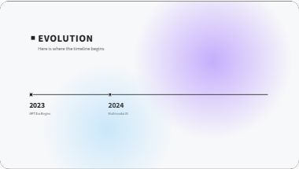</a> 
<strong>Tech Trends 2026 — Timeline</strong> 
Create a clean horizontal timeline animation featuring retro pixel nodes, a modern soft gradient background, and sequential milestone reveals. 
点击预览图，在 ChatCut 中使用
</td>
</tr>
<tr>
<td width="50%" valign="top">
 
<strong>Reconstruction Era — Bullet Points List</strong> 
Create a classical parchment-style layout comparing two historical subjects with animated bullet points. 
点击预览图，在 ChatCut 中使用
</td>
<td width="50%"></td>
</tr>
</table>

## 章节与标题

<table>
<tr>
<td width="50%" valign="top">
<a href="https://app.chatcut.io/?source=prompt-library&target=motion-graphics&template=2063446e-f68f-4284-ae99-aefd13bd4824">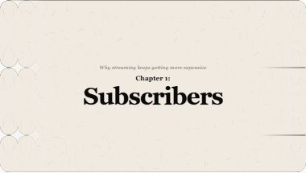</a> 
<strong>AI Paper Chapter Title</strong> 
Create paper Chapter Title title card template with editable text, layout, and visual styling. 
点击预览图，在 ChatCut 中使用
</td>
<td width="50%" valign="top">
 
<strong>AI Chapter Label</strong> 
Create skewed chapter label with bold headline, subtitle, and optional badge number for fast transitions. 
点击预览图，在 ChatCut 中使用
</td>
</tr>
<tr>
<td width="50%" valign="top">
<a href="https://app.chatcut.io/?source=prompt-library&target=motion-graphics&template=63ea06e3-3c00-4a22-920d-5b7e8df2b21b">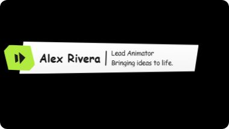</a> 
<strong>AI Paper Lower Third</strong> 
Create hand-drawn paper lower third with editable name, title, and intro copy. 
点击预览图，在 ChatCut 中使用
</td>
<td width="50%" valign="top">
<a href="https://app.chatcut.io/?source=prompt-library&target=motion-graphics&template=f11ec59a-6c28-4b03-8dae-e9e98516547d">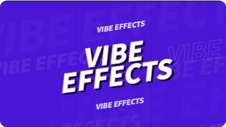</a> 
<strong>Vibe Effects Title Card</strong> 
Create a bold full-screen title opener with a staggered column wipe-in, italic layered text, and a fast split-exit animation — perfect for high-energy intros and channel branding. 
点击预览图，在 ChatCut 中使用
</td>
</tr>
<tr>
<td width="50%" valign="top">
<a href="https://app.chatcut.io/?source=prompt-library&target=motion-graphics&template=c8675840-2115-4060-be44-0d6be2fc8827">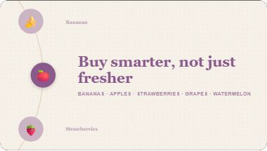</a> 
<strong>AI Dial Chapter Card</strong> 
Create a refined chapter card featuring a rotating dial animation on the left and elegant serif typography on the right. Perfect for segment transitions or product highlights. 
点击预览图，在 ChatCut 中使用
</td>
<td width="50%" valign="top">
 
<strong>Type emphasis animation</strong> 
Create a dynamic multi-line title card where words slide up and fade in sequentially before sliding out to the left. 
点击预览图，在 ChatCut 中使用
</td>
</tr>
<tr>
<td width="50%" valign="top">
 
<strong>MindSpace — Chapter One: Awareness</strong> 
Create motion graphics with this template. Describe your data, message, brand style, or visual changes. 
点击预览图，在 ChatCut 中使用
</td>
<td width="50%" valign="top">
<a href="https://app.chatcut.io/?source=prompt-library&target=motion-graphics&template=366dffd3-b6f4-4e47-a05c-37921e5b2852">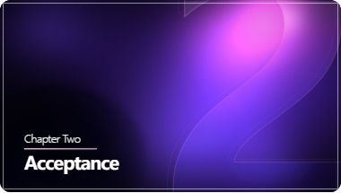</a> 
<strong>MindSpace — Chapter Two: Acceptance</strong> 
Create motion graphics with this template. Describe your data, message, brand style, or visual changes. 
点击预览图，在 ChatCut 中使用
</td>
</tr>
<tr>
<td width="50%" valign="top">
 
<strong>MindSpace — Chapter Three: Boundaries</strong> 
Create motion graphics with this template. Describe your data, message, brand style, or visual changes. 
点击预览图，在 ChatCut 中使用
</td>
<td width="50%" valign="top">
 
<strong>MindSpace — Chapter Four: Healing</strong> 
Create motion graphics with this template. Describe your data, message, brand style, or visual changes. 
点击预览图，在 ChatCut 中使用
</td>
</tr>
<tr>
<td width="50%" valign="top">
 
<strong>MindSpace — Chapter Five: Growth</strong> 
Create a WebGL-powered chapter title card featuring animated glowing fluid backgrounds, large glass-styled numerals, and smooth spring-revealing typographic elements. 
点击预览图，在 ChatCut 中使用
</td>
<td width="50%" valign="top">
<a href="https://app.chatcut.io/?source=prompt-library&target=motion-graphics&template=c77f1306-07a0-400c-aa05-303538c87ea0">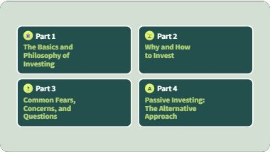</a> 
<strong>Chapter overview page — 4-part grid</strong> 
Create a 2x2 grid layout displaying chapter parts with icons, titles, and retro pixel-style subtitles, animating in sequentially. 
点击预览图，在 ChatCut 中使用
</td>
</tr>
<tr>
<td width="50%" valign="top">
 
<strong>Chapter title card — icon + letter-by-letter reveal with motion blur exit</strong> 
Create a full-screen chapter title with soft organic background waves, an animated popping icon, and beautifully staggered serif typography. Exits with a cinematic slide and... 
点击预览图，在 ChatCut 中使用
</td>
<td width="50%" valign="top">
<a href="https://app.chatcut.io/?source=prompt-library&target=motion-graphics&template=a75ac7ba-db04-4266-93b9-9ebd0614dc06">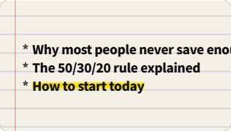</a> 
<strong>Finance Explainer — Chapter Marker Notebook</strong> 
Create a notebook-style chapter card that shows three agenda items over a lined paper background photo. Each line gets a yellow highlight that sweeps across the text and then... 
点击预览图，在 ChatCut 中使用
</td>
</tr>
<tr>
<td width="50%" valign="top">
 
<strong>Name card animation</strong> 
Create a stylish lower-third with a 3-layer sequential drop bar, shoot-on-threes typewriter text, and a rigid mask reveal for the subtitle. 
点击预览图，在 ChatCut 中使用
</td>
<td width="50%" valign="top">
 
<strong>Letter drop title — HOW DO YOU DIFFERENTIATE</strong> 
Create letter-by-letter kinetic title drop with motion blur, glow bloom, and staggered entry. 
点击预览图，在 ChatCut 中使用
</td>
</tr>
<tr>
<td width="50%" valign="top">
 
<strong>Takeaway lower-third overlay</strong> 
Create a broadcast-style lower third featuring a bold title, an animated accent underline, and typewriter-style staggered word reveals for body text. 
点击预览图，在 ChatCut 中使用
</td>
<td width="50%" valign="top">
<a href="https://app.chatcut.io/?source=prompt-library&target=motion-graphics&template=a73aa354-9e8c-459a-a94a-78b0547d9a67">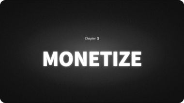</a> 
<strong>Dark cinematic chapter title card — &quot;Number 3 / TONE&quot;</strong> 
Create a dark, premium chapter title card featuring a subtle background dot pattern and an intense, blooming text glow effect. Perfect for cinematic transitions and high-end tech... 
点击预览图，在 ChatCut 中使用
</td>
</tr>
<tr>
<td width="50%" valign="top">
<a href="https://app.chatcut.io/?source=prompt-library&target=motion-graphics&template=200c97a4-3958-4074-ba27-1080eb91a5ce">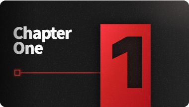</a> 
<strong>Dark Tech — Chapter Title Card</strong> 
Create a sleek, tech-inspired startup phase title with animated glowing line and grid canvas grain. 
点击预览图，在 ChatCut 中使用
</td>
<td width="50%" valign="top">
<a href="https://app.chatcut.io/?source=prompt-library&target=motion-graphics&template=82cf935e-d02a-496b-bad3-12a3876328a9">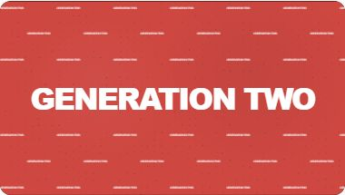</a> 
<strong>Generation Two — chapter title card</strong> 
Create motion graphics with this template. Describe your data, message, brand style, or visual changes. 
点击预览图，在 ChatCut 中使用
</td>
</tr>
<tr>
<td width="50%" valign="top">
<a href="https://app.chatcut.io/?source=prompt-library&target=motion-graphics&template=6cb35207-77ab-4538-8b60-9fe32f493460">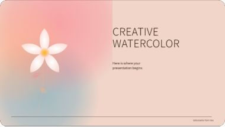</a> 
<strong>Creative Watercolor — Chapter Title Card</strong> 
Create a elegant, feminine presentation title featuring soft abstract watercolor washes, organic floral shapes, and refined serif typography. 
点击预览图，在 ChatCut 中使用
</td>
<td width="50%" valign="top">
 
<strong>Group Project — Chapter Title Card</strong> 
Create a immersive presentation opening slide featuring a dynamic, liquid-silk metallic background with elegant typography animations. 
点击预览图，在 ChatCut 中使用
</td>
</tr>
<tr>
<td width="50%" valign="top">
<a href="https://app.chatcut.io/?source=prompt-library&target=motion-graphics&template=5a3d3074-e947-454c-be17-61763d195186">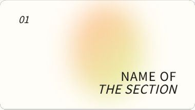</a> 
<strong>Minimal Gradient — Chapter Title Card</strong> 
Create a editorial title card featuring extreme whitespace, a soft organically drifting gradient blob, and high-contrast mixed-weight serif typography. 
点击预览图，在 ChatCut 中使用
</td>
<td width="50%" valign="top">
<a href="https://app.chatcut.io/?source=prompt-library&target=motion-graphics&template=1afea496-4002-4a6e-9a22-2e8da948f086">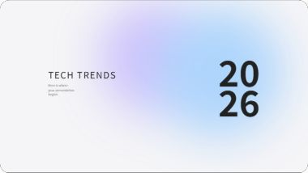</a> 
<strong>Tech Trends 2026 — Chapter Title Card</strong> 
Create a stylish title card blending retro pixel display numbers with modern typography and a soft floating gradient background. 
点击预览图，在 ChatCut 中使用
</td>
</tr>
<tr>
<td width="50%" valign="top">
<a href="https://app.chatcut.io/?source=prompt-library&target=motion-graphics&template=588b4fb1-6178-4e49-a8f9-42e947c0e4fc">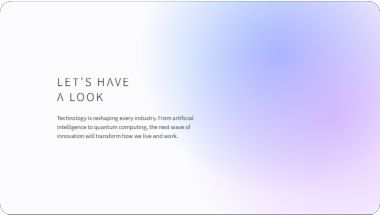</a> 
<strong>Tech Trends 2026 — Company Introduction</strong> 
Create a clean, modern title slide featuring oversized wide-spaced typography, soft ambient corner gradients, and a generous use of whitespace. 
点击预览图，在 ChatCut 中使用
</td>
<td width="50%" valign="top">
 
<strong>Reconstruction Era — Highlight Quote</strong> 
Create a elegant classical slide featuring a Victorian-style drawn border with corner flourishes, a large dash-decorated quote, and a descriptive subtitle. Ideal for introducing... 
点击预览图，在 ChatCut 中使用
</td>
</tr>
<tr>
<td width="50%" valign="top">
 
<strong>Reconstruction Era — Chapter Title Card</strong> 
Create a ornate Victorian-era presentation title card with parchment background, elegant scrollwork borders, and classic serif typography. 
点击预览图，在 ChatCut 中使用
</td>
<td width="50%"></td>
</tr>
</table>

## 引用与字幕条

<table>
<tr>
<td width="50%" valign="top">
 
<strong>AI Story Quote Card</strong> 
Create a full-screen quote card that animates lines of text individually sliding up and fading in with an accented final line. 
点击预览图，在 ChatCut 中使用
</td>
<td width="50%" valign="top">
 
<strong>AI Tweet Quote Card</strong> 
Create pixel-accurate X/Twitter screenshot-style quote card with real avatar, spring animation, light/dark theme. All fields editable. 
点击预览图，在 ChatCut 中使用
</td>
</tr>
<tr>
<td width="50%" valign="top">
 
<strong>MindSpace — Quote Card</strong> 
Create a vibrant blue-purple gradient quote card that pops in smoothly without bouncing, featuring large stylish oversized quote marks on the corners. 
点击预览图，在 ChatCut 中使用
</td>
<td width="50%" valign="top">
 
<strong>Quote card slide-in with word-by-word reveal</strong> 
Create a semi-transparent quote card drops in smoothly from the top, followed by a word-by-word fade and slide-in effect for the typography. 
点击预览图，在 ChatCut 中使用
</td>
</tr>
<tr>
<td width="50%" valign="top">
 
<strong>Stock Market lower-third banner animation</strong> 
Create a broadcast-style lower third where bold text slides up, followed by a solid color block sliding in from the left to highlight it, finishing with a smooth downward exit. 
点击预览图，在 ChatCut 中使用
</td>
<td width="50%" valign="top">
 
<strong>Lower Third - Ball Swipe Typewriter Reveal</strong> 
Create a dynamic lower third sequence where a suspended ball sweeps right, triggering an expanding background and character-by-character typewriter text reveals, finished with a... 
点击预览图，在 ChatCut 中使用
</td>
</tr>
<tr>
<td width="50%" valign="top">
 
<strong>Manychat-style card slide-up with text mask reveal</strong> 
Create a dynamic lower-third card that slides up from the bottom, followed by a leftward sweeping gradient mask reveal of the right-side text details, matching the provided... 
点击预览图，在 ChatCut 中使用
</td>
<td width="50%" valign="top">
 
<strong>Dark Tech — Callout Tag</strong> 
Create a sharp, skewed parallelogram callout that reveals from the vertical center outward, acting as a clean mask for the text inside. 
点击预览图，在 ChatCut 中使用
</td>
</tr>
<tr>
<td width="50%" valign="top">
 
<strong>Reconstruction Era — Lower Third Name Tag</strong> 
Create a elegant Victorian-style lower-third with an aged parchment texture, ornate corner flourishes, and classic serif typography. 
点击预览图，在 ChatCut 中使用
</td>
<td width="50%"></td>
</tr>
</table>

## 其他动效

<table>
<tr>
<td width="50%" valign="top">
 
<strong>AI Video Script Builder</strong> 
Create a tool that creates short video scripts with hooks, scenes, and timing automatically. 
点击预览图，在 ChatCut 中使用
</td>
<td width="50%" valign="top">
 
<strong>Keyword typing animation</strong> 
Create a two-line text overlay where words slide up individually. A specific set of words receives an expanding colored background highlight block. Contains an organic torn paper... 
点击预览图，在 ChatCut 中使用
</td>
</tr>
<tr>
<td width="50%" valign="top">
 
<strong>MindSpace — Topic Menu</strong> 
Create a 3-item animated menu that reveals sequentially top-to-bottom. For each row, the triangle icon pops in first, followed immediately by the text sliding in. 
点击预览图，在 ChatCut 中使用
</td>
<td width="50%" valign="top">
 
<strong>MindSpace — Ribbon Statement</strong> 
Create a dynamic fluid ribbon draws an S-curve across the screen in 3 phases with a word-by-word staggered text spring reveal. 
点击预览图，在 ChatCut 中使用
</td>
</tr>
<tr>
<td width="50%" valign="top">
 
<strong>Retention Graph</strong> 
Create motion graphics with this template. Describe your data, message, brand style, or visual changes. 
点击预览图，在 ChatCut 中使用
</td>
<td width="50%" valign="top">
 
<strong>Principle card — dot background, text left-slide</strong> 
Create a cream panel with a dotted background that slides up from the bottom, followed by text elements sliding in from the left using a fast-to-slow cubic bezier easing. 
点击预览图，在 ChatCut 中使用
</td>
</tr>
<tr>
<td width="50%" valign="top">
 
<strong>News info card</strong> 
Create motion graphics with this template. Describe your data, message, brand style, or visual changes. 
点击预览图，在 ChatCut 中使用
</td>
<td width="50%" valign="top">
 
<strong>Finance Explainer — Poll Card Progress Bars</strong> 
Create a poll card that animates on screen with a question, vote count, and four answer options. Each bar grows from left to right showing the percentage, with the numbers rolling... 
点击预览图，在 ChatCut 中使用
</td>
</tr>
<tr>
<td width="50%" valign="top">
 
<strong>White bold serif text slide-in reveal animation</strong> 
Create two lines of bold serif text sliding in from the left one after another, governed by a dramatic slow-fast-slow Bezier easing curve. 
点击预览图，在 ChatCut 中使用
</td>
<td width="50%" valign="top">
 
<strong>Dark Tech — Feature Showcase</strong> 
Create a 6-second animated slide with a pulsing dot-grid background and a clean white card that fades in to display your product screenshot. 
点击预览图，在 ChatCut 中使用
</td>
</tr>
<tr>
<td width="50%" valign="top">
 
<strong>Dark Tech — Price Tier Panel</strong> 
Create a dynamic half-screen overlay sliding in from the left, featuring a subtle floating dot background and bold broadcast-style condensed text. The right half remains perfectly... 
点击预览图，在 ChatCut 中使用
</td>
<td width="50%" valign="top">
 
<strong>Dark Tech — Price Badge Popup</strong> 
Create a bold, rounded single-layer price card that bounces in from below with a dynamic skewed price typography. 
点击预览图，在 ChatCut 中使用
</td>
</tr>
<tr>
<td width="50%" valign="top">
 
<strong>Creative Watercolor — Company Introduction</strong> 
Create a warm, organic presentation layout featuring subtle watercolor washes, elegant typography, and a delicate expanding separator line. 
点击预览图，在 ChatCut 中使用
</td>
<td width="50%" valign="top">
 
<strong>Creative Watercolor — Team Members</strong> 
Create a soft, elegant presentation of three members with organic watercolor splash backgrounds and painted borders, grouped perfectly under one component. 
点击预览图，在 ChatCut 中使用
</td>
</tr>
<tr>
<td width="50%" valign="top">
 
<strong>Group Project — Company Introduction</strong> 
Create a full-screen typographic composition over an animated, fluid liquid metal texture background. 
点击预览图，在 ChatCut 中使用
</td>
<td width="50%" valign="top">
 
<strong>Minimal Gradient — Company Introduction</strong> 
Create a elegant minimal layout with oversized typography, extreme whitespace, and a soft drifting gradient orb in the corner. 
点击预览图，在 ChatCut 中使用
</td>
</tr>
<tr>
<td width="50%" valign="top">
 
<strong>Minimal Gradient — Team Members</strong> 
Create a minimal, elegant team presentation slide featuring soft organic background orbs, extremely generous spacing, and sophisticated typography. 
点击预览图，在 ChatCut 中使用
</td>
<td width="50%"></td>
</tr>
</table>

## App Promo

<table>
<tr>
<td width="50%" valign="top">
 
<strong>AI Documentary Ad Video</strong> 
Create a short documentary-style promo video for a product page. 
<a href="https://app.chatcut.io/?source=prompt-library&target=app-promo&preset=d3e92255-157b-4bfd-8b5f-d70c6008592b">在 ChatCut 中使用 →</a>
</td>
<td width="50%" valign="top">
 
<strong>AI Pop-Style Ad Video</strong> 
Create a short pop-style promo video for a product page with a simple narrative arc. 
<a href="https://app.chatcut.io/?source=prompt-library&target=app-promo&preset=57d50d37-087c-4a59-833b-472a59fbf355">在 ChatCut 中使用 →</a>
</td>
</tr>
<tr>
<td width="50%" valign="top">
 
<strong>AI Stop-Motion Ad Video</strong> 
Create a short felt-style promo video for a product page. 
<a href="https://app.chatcut.io/?source=prompt-library&target=app-promo&preset=24306932-df20-4302-a755-ac4239141be6">在 ChatCut 中使用 →</a>
</td>
<td width="50%" valign="top">
 
<strong>AI Claymation Ad Video</strong> 
Create a short claymation-style promo video for a product page. 
<a href="https://app.chatcut.io/?source=prompt-library&target=app-promo&preset=fb53a08c-0072-470b-bc0f-e799e8aa8888">在 ChatCut 中使用 →</a>
</td>
</tr>
<tr>
<td width="50%" valign="top">
 
<strong>AI Frosted-Glass Ad Video</strong> 
Create a short frosted-glass promo video for a product page. 
<a href="https://app.chatcut.io/?source=prompt-library&target=app-promo&preset=fbfe5887-8d67-4102-8312-b06151aebabb">在 ChatCut 中使用 →</a>
</td>
<td width="50%"></td>
</tr>
</table>

## Seedance 2 视频生成

<table>
<tr>
<td width="50%" valign="top">
 
<strong>AI Product Launch Video</strong> 
Create a 15-second studio product launch ad from a product reference in 16:9. 
<a href="https://app.chatcut.io/?source=prompt-library&target=video-gen&preset=d4404826-a3cd-4f72-ac0c-9875c26ba07d">在 ChatCut 中使用 →</a>
</td>
<td width="50%" valign="top">
 
<strong>AI Storyboard-to-Film</strong> 
Turn a 9-panel storyboard into a continuous 10-15 second cinematic short in 16:9. 
<a href="https://app.chatcut.io/?source=prompt-library&target=video-gen&preset=4d157b2c-9261-4a32-bfd2-0a7c0d04a2fe">在 ChatCut 中使用 →</a>
</td>
</tr>
<tr>
<td width="50%" valign="top">
 
<strong>AI Vehicle Transformation</strong> 
Transform a vehicle reference into a mechanical creature reveal in 16:9. 
<a href="https://app.chatcut.io/?source=prompt-library&target=video-gen&preset=abae28f1-c55d-4dd8-af7b-aebd330c53fb">在 ChatCut 中使用 →</a>
</td>
<td width="50%" valign="top">
 
<strong>AI Hero Scene Video</strong> 
Create a 15-second cinematic hero scene around a stylized character with clear visual traits. 
<a href="https://app.chatcut.io/?source=prompt-library&target=video-gen&preset=44ce7ebb-4b37-435f-acb1-9fba31e9fb3d">在 ChatCut 中使用 →</a>
</td>
</tr>
<tr>
<td width="50%" valign="top">
 
<strong>AI Cinematic Logo Reveal</strong> 
Turn a logo reference into a 6-second cinematic 3D reveal in 16:9. 
<a href="https://app.chatcut.io/?source=prompt-library&target=video-gen&preset=a4acd454-d87e-4d7a-9eb1-9a71084d38dd">在 ChatCut 中使用 →</a>
</td>
<td width="50%" valign="top">
 
<strong>AI Comic-to-Film Video</strong> 
Turn a comic reference into a short live-action cinematic sequence in 16:9. 
<a href="https://app.chatcut.io/?source=prompt-library&target=video-gen&preset=5641a5c8-a8c3-4a7b-821f-8a47f8a56165">在 ChatCut 中使用 →</a>
</td>
</tr>
<tr>
<td width="50%" valign="top">
 
<strong>AI Billboard Product Ad</strong> 
Place a product reference on a Times Square billboard in a short cinematic time-lapse, framed for 16:9. 
<a href="https://app.chatcut.io/?source=prompt-library&target=video-gen&preset=ba023432-3975-4787-beb0-cdcfc3542fba">在 ChatCut 中使用 →</a>
</td>
<td width="50%" valign="top">
 
<strong>AI Glitch Logo Reveal</strong> 
Animate a logo reference with a 4-second RGB glitch reveal in 16:9. 
<a href="https://app.chatcut.io/?source=prompt-library&target=video-gen&preset=fc4e6c02-072d-4958-a3d3-9f90fe7ebee7">在 ChatCut 中使用 →</a>
</td>
</tr>
<tr>
<td width="50%" valign="top">
 
<strong>AI Liquid Logo Reveal</strong> 
Animate a logo reference into a 6-second liquid-particle reveal in 16:9. 
<a href="https://app.chatcut.io/?source=prompt-library&target=video-gen&preset=714c8bca-1b8c-4116-bb57-ada20890de94">在 ChatCut 中使用 →</a>
</td>
<td width="50%" valign="top">
 
<strong>AI ASMR Product Video</strong> 
Create a short ASMR-style product video from a product reference in 9:16. 
<a href="https://app.chatcut.io/?source=prompt-library&target=video-gen&preset=158a512d-db53-44d4-b7bc-8717df6a49fe">在 ChatCut 中使用 →</a>
</td>
</tr>
<tr>
<td width="50%" valign="top">
 
<strong>AI Hair Care Commercial</strong> 
Create a short premium hair-care commercial from a beauty reference in 16:9. 
<a href="https://app.chatcut.io/?source=prompt-library&target=video-gen&preset=b132219a-03c4-417a-a9a1-a6b06a796411">在 ChatCut 中使用 →</a>
</td>
<td width="50%" valign="top">
 
<strong>AI Pet Podcast Video</strong> 
Turn two pet references into a playful 15-second podcast skit in 16:9. 
<a href="https://app.chatcut.io/?source=prompt-library&target=video-gen&preset=68323c16-db0e-42e6-b528-46329affb510">在 ChatCut 中使用 →</a>
</td>
</tr>
<tr>
<td width="50%" valign="top">
 
<strong>AI Multi-Frame Cinematic Shot</strong> 
Blend three reference frames into one seamless 15-second cinematic shot in 16:9. 
<a href="https://app.chatcut.io/?source=prompt-library&target=video-gen&preset=8f627e2f-2e06-493b-b41e-1d2389dbb44f">在 ChatCut 中使用 →</a>
</td>
<td width="50%" valign="top">
 
<strong>AI Time Freeze Video</strong> 
Create a 15-second cinematic time-freeze scene in 16:9. 
<a href="https://app.chatcut.io/?source=prompt-library&target=video-gen&preset=cc05c29b-f0b8-4858-95cd-aa5f1ef71e93">在 ChatCut 中使用 →</a>
</td>
</tr>
</table>
